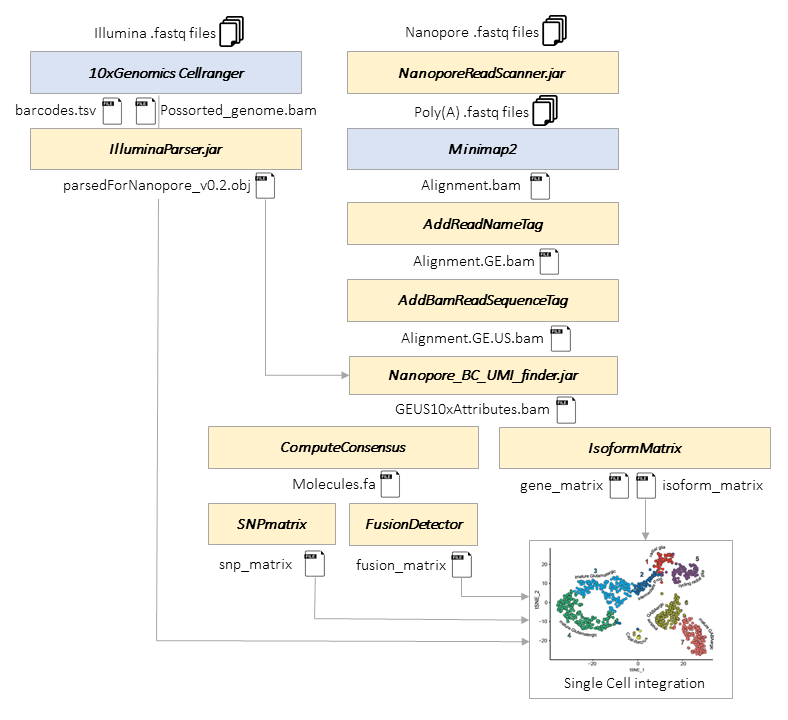

SiCeLoRe (Single Cell Long Read) is a suite of tools dedicated to cell barcode / UMI (unique molecular identifier) assignment and bioinformatics analysis of highly multiplexed single cell Nanopore or PacBIo long read sequencing data.

Typically starting with a single cell short read bam file and Nanopore or PacBio long reads, the workflow integrates several sequential steps for cell barcode and UMI assignment to long reads (guided by short read data), transcript isoform identification, generation of molecules consensus sequences (UMI-guided error-correction) and production of [isoforms / junctions / SNPs x cells] count matrices for new modalities integration into standard single cell RNA-seq statistical analysis.

# Installation

just copy files.

requires: 

* Java 8,

* [Minimap2](https://github.com/lh3/minimap2),

* [poa](https://github.com/tanghaibao/bio-pipeline/tree/master/poaV2)

* [racon](https://github.com/isovic/racon)

* [fastp](https://github.com/OpenGene/fastp)

* samtools

# Workflow



# Features

[1) Parsing of Illumina Data](#parsing-illumina-data)

Parses short read data and retrieves info on used cell barcodes and UMIs.

[2) Nanopore poly(A) scan - stranding of reads](#nanopore-scan)

Pre-scan of Nanopore reads for poly(A) tails -> stranded reads.

[3) Mapping of Nanopore reads to the reference genome with minimap2](#minimap2-mapping)

[4) Tag Nanopore SAM records with gene names, read sequence and quality values](#nanopore-tagging)

Adds gene names, read sequence and QV values. Required for barcode and UMI assignment

[5) Barcode and UMI assignment to Nanopore SAM records](#bc-assignment)

[6) Consensus sequence calculation for RNA molecules (UMIs)](#ComputeConsensus)

Generates consensus sequence for transcripts from multiple reads for UMI.

[7) Mapping of molecules consensus sequences to the reference genome with minimap2](#molecule-consensus-mapping)

Consensus sequences are mapped to the reference genome

[8) Tag molecule SAM records with gene names, cell barcodes and UMI sequence](#molecule-tagging)

Adds gene names, cell barcode and UMI sequence. Required for [cell x genes/isoforms/junctions] matrices generation

[9) Transcript isoform expression quantification](#IsoformMatrix)

Identifies matching Gencode transcript isoforms and generates [cell x genes/isoforms/junctions] matrices.

[10) SNP calling](#snp-calling)

Calling nucleotide polymorphism cell by cell

[11) Fusions gene calling](#fusion-calling)

Detecting fusion transcripts cell by cell

[12) Novel transcripts isoforms detection](#collapse-model)

Indentifying novel transcripts isoforms 

## Authors

* Kevin Lebrigand <[lebrigand@ipmc.cnrs.fr](mailto:lebrigand@ipmc.cnrs.fr)>

[](https://twitter.com/kevinlebrigand)

* Rainer Waldmann <[waldmann@ipmc.cnrs.fr](mailto:waldmann@ipmc.cnrs.fr)>

<a id="parsing-illumina-data"></a>

## Quick run analysis

We provide test data as a subsampling of reads for the Mus musculus Clta locus for the 190 cells dataset.
It requires java 1.8 (JAVA_HOME), minimap2, samtools in your PATH as well as racon and poa (including blosum80.mat in same folder) for consensus calling part.
This test script should takes under 5mn to run, output files are located in ./output_dir directory.

```

git clone https://github.com/ucagenomix/sicelore.git
cd sicelore
chmod +x quickrun.sh
dos2unix quickrun.sh
export JAVA_HOME=<path to Java 1.8>
export PATH=$PATH:<minimap2path>:<samtoolspath>:<raconpath>:<poapath>
./quickrun.sh

```


## 1) Parsing of Illumina Data

Genome mapped short read data generated by the 10xGenomics CellRanger software (typically "possorted_genome_bam.bam" file) are parsed and info on cell barcodes and UMIs associated with each gene or genomic region are saved in a serialized nested Java Hashtable which is required for barcode and UMI assignment to Nanopore reads.

### Required files

* IlluminaParser.jar

* Libraries in the ./lib folder

* genome matched, barcode and UMI assigned Illumina short read data (e.g. bam file generated by 10x genomics cell ranger).

* the 10x Genomics Cell Ranger tsv file that contains list of cell associated barcodes.

### Usage

```

java -Xmx15000m -jar IlluminaParser.jar --inFileIllumina possorted_genome_bam.bam \
--tsv barcodes.tsv --outFile parsedForNanopore_v0.2.obj --cellBCflag CB --umiFlag UB --geneFlag GN

```

### Parameters

**-b,--cellBCflag** (required)

SAM tag for cell BC in Illumina bam file. Cell barcodes in cellranger bam files have a "-1" at the end. If other single cell sequencing systems were used, the "-1" at the end of the BC is not required. The "-" and following characters are ignored. This is the assigned cell Barcode and not the read sequence for the cell barcode. In Cell Ranger bam files it is the BC tag.

**-u,--umiFlag** (required)

SAM tag for umi in the Illumina bam file. This is the assigned UMI and not the read sequence for the UMI. In Cell Ranger bam files this is the sequence in the UB tag.

**-g,--geneFlag** (required)

SAM tag for Gene name in Illumina bam file.

**-i,--inFileIllumina** (required)

path of bam file with genome matched Illumina data generated by 10xGenomics CellRanger

**-t,--tsv** (required)

the 10xGenomics tsv file that contains list of cell associated barcodes. The file contains the list of cell barcodes that are associated with a cell. One cell barcode per line. 10x Genomics barcode tsv files have a "-1" appended to the barcode sequence. The "-1" is not required and can be omitted if non-10xGenomics systems are used.

**-o,--outFile** (required)

full path of output file where the Illumina barcode/UMI data are saved. File required for [Barcode and UMI assignment to Nanopore SAM records](#bc-assignment) .

<a id="nanopore-scan"></a>

## 2) Scan for poly(A) and adapters in Nanopore reads.

Scans the Nanopore fastq reads for poly(A/T) and adapter sequence and generates stranded (forward) reads for reads with found polyA and adapter.

Scans by default for >= 15 nt. polyA (or T) with >= 75% As within 100 nt from both ends of the read. If poly(A) was found, Searches for a 10xGenomics adapter sequence "CTTCCGATCT" downstream of the poly(A).

When poly(A) and adapter were found at one end the read is written stranded (forward) into a "pass" folder.

Failed reads are written unstranded into a "failed" folder.

This is an optional step. Cell barcode and UMI assignment also works with non-stranded records.

### Required files

* NanoporeReadScanner.jar

* Libraries in the ./lib folder

* Config file: ReadScannerConfig.xml (Most default settings can be changed there).

If no ReadScannerConfig.xml file is found in the current path (working directory), the software takes the default config file from the directory where the applications (jars) are installed.

### Usage

```

java -jar <path>/NanoporeReadScanner.jar -d <directory to start recursive search for fastq files>

```

### Parameters

**-d,--inDir** (either this or –fastqFiles required)

directory to start file search. starting at this directory, takes recursively fastq files that match the RegEx pattern given in –pattern

**-i,--fastqFiles** (either this or – inDir required)

" ," seperated list of fastq files

**-v,-- pattern** (optional, defaults)

fastq File name pattern to search when parsing folders recursively: defaults to: "**.{1,}\.fastq**"

**-f,--fractionAT** (optional, defaults)

min fraction AT, defaults to value in ReadScannerConfig.xml :0.75

**-p,--polyAlength** (optional, defaults)

min length of polyA, defaults to value in ReadScannerConfig.xml : 15

**-w,--windowAT** (optional, defaults)

window to search for AT from the extremities of the read, defaults to value in ReadScannerConfig.xml: 100 nt.

**-o,--outDir**

Output Directory, Creates a “failed” and “passed” sub-folder there with failed and stranded passed reads (found polyA and adapter) respectively.

If "null" is given as output directory it won't write but just generate some stats.

<a id="minimap2-mapping"></a>

## 3) Mapping of Nanopore reads to the reference genome with minimap2

**fastq splitting into chunks for paralellization**

Can be omitted for small runs (< 5 million reads)

Prior to mapping the fastqs are split into chunks.

uses [fastp](https://github.com/OpenGene/fastp)

```

fastp -i nanopore_reads.fastq -Q -A --thread 1 --split_prefix_digits=4 --out1=sub.fastq --split=8

```

**parallel minimap2 mapping*

command shown for fastq batch "0001.sub.fastq"

```

minimap2 -ax splice -uf --MD --sam-hit-only -t 20 --junc-bed junctions.bed $BUILD.mmi 0001.sub.fastq > 0001.sub.sam
samtools view -Sb 0001.sub.sam -o 0001.sub.unsorted.bam
samtools sort 0001.sub.unsorted.bam -o 0001.sub.bam
samtools index 0001.sub.bam

```

**--junc-bed** (required)

BED file consisting of annotated introns and their strands. With this option, **minimap2** prefers splicing in annotations.

can be generated with **`paftools.js gff2bed -j ann.gtf'** (Paftools is part of the minimap distribution)

<a id="nanopore-tagging"></a>

## 4) Tag Nanopore SAM records with gene names, read sequence and quality values

### add gene names to Nanopore SAM records

**uses AddGeneNameTag (sicelor.jar)**

Add gene names to Nanopore SAMrecords GE tag using **AddGeneNameTag** (sicelor.jar) pipeline, long read optimization of code from [Drop-seq tools v1.13](http://mccarrolllab.com/download/1276/).

If another tag is used for gene names, the Gene name SAM tag needs to be changed using the TAG argument in command line.

Rapid, all jobs can be run on one compute node or distributed on a cluster.


command shown is for BAM batch "0001.sub.bam"

```

java -jar -Xmx12g sicelor.jar AddGeneNameTag I=0001.sub.bam O=0001.sub.GE.bam REFFLAT=refFlat.txt TAG=GE ALLOW_MULTI_GENE_READS=true USE_STRAND_INFO=true VALIDATION_STRINGENCY=SILENT
samtools index 0001.sub.GE.bam

```

**parameters**

**INPUT=,I=** (required)

The input SAM or BAM file to analyze

**OUTPUT=,O=** (required)

The output BAM, written with new Gene/Exon tag

**TAG=** (required)

The tag name to use. When there are multiple genes, they will be comma seperated (Default value: GE)

**USE_STRAND_INFO=Boolean**

Use strand info to determine what gene to assign the read to. If this is on, reads can be assigned to a maximum of one gene (Default value: true)

**ALLOW_MULTI_GENE_READS=Boolean**

Allow a read to span multiple genes. If set to true, the gene name will be set to all the genes the read spans. Gene names will be comma separated (Default value: true)

**STRANDTAG=**

Gene strand tag (default=GS)

**FUNCTIONTAG=**

Gene function tag (default=XF)


### add read sequence and QV values to Nanopore SAM records

**uses AddBamReadSequenceTag (sicelor.jar)**

SAMrecords are tagged with read sequence (US tag) and read quality (UQ tag). Is used for BC/UMI assignment and molecule consensus calculation.

QVs are currently just used to generate some QV stats during BC and UMI assignment -> adding QVs is optional.

Fast, all jobs can be run on one compute node.

command shown for BAM batch "0001.sub.bam"


```

java -jar -Xmx12g sicelor.jar AddBamReadSequenceTag I=0001.sub.GE.bam O=0001.sub.GEUS.bam FASTQ=0001.sub.fastq
samtools index 0001.sub.GEUS.bam

```

***parameters***

**INPUT=,I=** (required)

The input SAM or BAM file to analyze

**OUTPUT=,O=** (required)

The output BAM, written with new Gene/Exon tag

**FASTQ=** (required)

The Nanopore .fastq file previously used for [minimap2 mapping](#minimap2-mapping)

<a id="bc-assignment"></a>

## 5) Nanopore Barcode/UMI assignment

- Searches for cell barcodes and UMIs in genome matched Nanopore BAM files.

- Uses the barcode/UMI info of the Illumina short read data (output of [IlluminaParser.jar](#parsing-illumina-data)) to guide barcode assignment.

- Will re-scan for poly(A) and adapter since positions are needed to extract potential cell barcode and UMI sequences.

Uses a "brute force approach".

For barcode assignment the putative barcode sequence flanking the 10xGenomics adapter is extracted and matching barcodes for the same gene are searched in the Illumina data. If no match is found, all possible mutants (including indels) of the sequence are generated up to a defined maximal edit distance and tested for matching barcodes for the same gene in the Illumina data. If no match was found for the same gene or if the Nanopore SAM record is not annotated with a gene, the search is carried out for matching barcodes for the same genomic region (default window size 500 nt).

The maximal edit distance can be fixed or dynamic. Dynamic edit distance adapts the maximal edit distance to the complexity of the search set.

**bcMaxEditDistances.xml** contains maximal edit distances allowed for different false assignment percentages.

For UMI assignment, matching UMIs are only searched when a cell barcode was identified. Matching UMIs are searched for the same cell and the same gene or genomic region in the Illumina data. Just as the barcode edit distance, the UMI edit distance can be fixed or dynamically adjusted to the complexity of the search set.

**umiMaxEditDistances.xml** contains maximal edit distances allowed for different false assignment percentages.

Found cell barcodes are added to the BC tag and UMI sequences to the U8 tag by default.

Info on barcode and UMI position in read, edit distances and other info is written to various tags. See "config.xml" for more details and customization.

Paralellize, process batches generated in [(4)](#nanopore-tagging) on compute nodes if > 5 million reads.

### Required files

* Nanopore_BC_UMI_finder.jar

* Libraries in the ./lib folder

* Config.xml: Config file to set various parameters.

* bcMaxEditDistances.xml and umiMaxEditDistances.xml: contain max edit distances for various barcode and UMI false assignment percentages respectively.

If no config files are found in the current path (working directory) , the software takes the config files from the directory where the application (jar) is.

### Usage

```

java -jar -Xmx30g NanoporeBC_UMI_finder.jar -i <Nanopore Bam, e.g. 0001.sub.GEUS.bam >
-o <cell bc and UMI assigned output bam file>
-k <Illumina data previously parsed with IlluminaParser.jar>
--maxUMIfalseMatchPercent 2
--maxBCfalseMatchPercent 5
--logFile <path to log output file>

```

**Note:** The parameters above result in a effective barcode false assignment rate of 0.1% since subsequent UMI scan [eliminates most mis-assigned barcodes](#bc-misassignment).

Highly multithreaded, will efficiently use all CPU cores at close to 100%.

**RAM requirement:**

Keeps the Illumina data and some info on parsed reads in RAM. 30 G is largely sufficient to scan a entire Promethion run with 50 - 100 million reads. A chunk with 20 million reads can typically be scanned with less than 10 Gb of RAM.

We typically give most of or all the RAM available on the compute node since CPUs are used at 100% anyway.

**Speed:**

With 30 Gb attributed RAM, a 20 core Xeon node processes about 300,000 - 500,000 SAM records/hour when default settings are used.

### Command line arguments override defaults in config xml.

#### Required

* **-i,--inFileNanopore**

Nanopore input BAM file. The genome aligned Nanopore BAM input file with the read sequence in “US” tag and the gene name (if any) in the “GE” tag. All tags can be changed in “config.xml”.

* **-k,--inFile10x**

10x Illumina File parsed by [IlluminaParser.jar](#parsing-illumina-data)

* **-y,--maxBCfalseMatchPercent** either this or –bcedit should be provided

Maximal percentage of false BC association. Will dynamically adjust BC edit distance depending on the numbers of cell barcodes to compare with.

Uses data from simulation in file bcMaxEditDistances.xml (can be changes in config.xml) in current working directory and if not found there in application root overrides fixed BC edit distance parameter.

<a id="bc-misassignment"></a>**Note:** The actual barcode false discovery rate is the product of barcode and UMI false discovery rate since a falsely assigned cell barcode will lead during subsequent UMI assignment to a search for matching UMIs among the UMIs associated with this false barcode --> UMI assignment will fail for the vast majority of wrong assigned barcodes.

e.g. --maxBCfalseMatchPercent 5 --maxUMIfalseMatchPercent 2 will lead to 0.05 * 0.02 = 0.1% false assigned barcodes amongst the barcode and UMI assigned reads and an effective barcode assignment accuracy of 99.9%.

* **-b,--bcedit** either this or –maxBCfalseMatchPercent should be provided

Fixed edit distance; max mismatches for cell barcode (fixed edit distance)

* **-j,--maxUMIfalseMatchPercent** either this or --umiedit should be provided

Maximal percentage of false UMI association. Will dynamically adjustUMI edit distance depending on the numbers of umis to compare with.

Uses simulation data from umiMaxEditDistances.xml in current working directory and if not found there in application root. Overrides fixed umi edit distance parameters.

* **-u,--umiedit** either this or –--maxUMIfalseMatchPercent should be provided.

Fixed edit distance; max errors (fixed edit distance) for umi

#### Optional (defaults can be modified in config xml)

* **-o,--outfile**

output bam file, if omitted will write file (inputfilename +"10xAttributes.bam" and file that contains only SAM entries with identified cellBC/UMI into <userhome>/<outdir> directory. Outdir defaults to “Nanopore_BC_UMIfinder”(set in config.xml).

* **-l,--logFile**

If not provided will create a default log with same name as outfile with “.log” appended in folder where output bam goes.

* **-a,--polyawin**

Window to search for poly(A/T) at both extremities, defaults to :100 (default in config.xml)

* **-e,--randomBarcode; -f,--randomUMI**

performs random Barcode or UMI Simulation. If a previously scanned and BC and UMI annotated file (the file with all entries not just the entries with found BC/UMIs) is rescanned with this option the max edit distance is the ED of the previously found match if any. Provide the barcode and UMI assigned BAM file (the file with all sam entries not just the BC/UMI assigned) as input BAM for the random barcode or umi scan (retrieves edit sdistance info for found BCs and UMIs there -> will do the random scan with same ED for the SAM entry).

* **-n,--bcEDlimitDyn**

when set, will limit the maximal edit distance to the given value. E.g. set to 3 -> will never test ED=4 even if few cells express gene or genomic region. Will speed up parsing.

default; no limit

only effective when dynamic barcode edit distance (--maxBCfalseMatchPercent) used.

* **-m,--umiEDlimitDyn**

when set, will limit the maximal UMI edit distance to the given value.

default; no limit

only effective when dynamic umi edit distance (--maxUMIfalseMatchPercent) is used.

* **-g,--ONTgene**

2 char SAM attribute for gene name in Nanopore SAM. Default: GE (from config.xml)

* **-h,--help**

* **-p,--adapterSeq** (default in config.xml)

adapter sequence preceeeding UMI or barcode. Has to be in config file or here.

* **-q,--adapterMaxErr** (default in config.xml)

max mismatches in adapter (Needleman alignment), default 3

* **-r,--tsMaxErr** (default in config.xml)

max number of TSO mismatches, default: 3

* **-s,--tsoseq** (default in config.xml)

TSO sequence, optional will be searched for and flagged if provided here or in “config.xml”, not used for read selection

**-t,--ncpu**

n threads generated - if not provided will use all available CPU cores

**-w,--polyAlength** (default in config.xml)

min polyA/T length, default 15.

* **-x,--polyATfraction** (default in config.xml)

fraction A/T in poly A/T tail, default: 0.75

* **-z,--edBCbailout** (default 2, in config.xml)

mut cycles (ED) after which testing is aborted for Barcode when match was found.

Avoids unnecessary testing and speeds up assignment but results in less info on secondary matches. E.g. if bail out at ED=2 and a match was found with ED=2 it won’t flag secondary matches at ED=4 in sam entry.

Defaults to always bail out at ED=2 if match was found.

#### SAM tags in output file

SAM tags in output bam can be modified in the config xml. If entry for tag is commented out in XML it won’t be printed. By default cell barcode is in BC tag and UMI in U8 tag.

Other info is added to the following tags by default:

- **Illumina data tags**

**IG** If barcode was found for matching Gene in Illumina data, the gene name from the Illumina data is here

- **polyA/T finding tags**

**AX** Read too short, not analyzed

**AZ** Pre-polyA/T sequence too short

**A0** Neither polyA nor polyT

**PE** End of polyA or polyT (1-based)

**PI** Internal polyAT (evtl. adapter). Tag is set if internal poly(A/T) found (potential chimeric read) Format: PA(for polyA)PT(for polyT)<begin-end>AD(if adapter found,)<adapterbegin-adapterend> ------ entire thing is concatenated when multiple matches were found.

If "AD" is in string it is very likely that read is from a concatameric cDNA.

- **Pre adapter finding checks and adapter Finding**

**A2** Both polyA and polyT

**AR** Read was reversed for scanning (poly A at 5')

**AM** Adapter not found

**AT** Too many adapter mismatches

**AB** Adapter start (1-based)

**AE** Adapter end (1-based)

- **TSO Finding**

**TN** TSO not found

**TM** TSO too many mismatches

**TB** TSO begin (1-based)

**TE** TSO end (1-based)

- **Barcode Finding**

**BN** Barcode not found

**B0** Gene not found in Illumina data

**B7** Genomic region not found in Illumina data

**BF** Cell BC found for matching Illumina Cell BC for data for same gene in same cell

**BR** Cell BC found for matching Illumina Cell BC for data for same genomic region in same cell

**BT** Cell BC only found for a cell that does not have Illumina data for this gene or genomic region

**B9** Cell BC only found in Illumina empty drops data

**BG** No gene in Nanopore SAM

**BS** Seq between adapter and polyAT too short to identify BC/UMI

**BM** More than one BC match with equal quality

**B1** BC edit distance (mutation cycles used)

**B2** BC edit distance second best match if any (mutation cycles used)

**BB** Barcode start (1-based)

**BE** Barcode end (1-based)

**BC** Cell BC sequence

- **Umi Finding**

**U9** More than one match with equal quality

**UT** Umi scan aborted: Post BC sequence too short

**U1** UMI edit distance (mutation cycles)

**U2** UMI edit distance (mutation cycles) of second best match (if any)

**UB** UMI start (1 based)

**UE** UMI end (one based)

**U8** UMI sequence


### merge all batches GEUS10xAttributes.bam bam files

Cell barcode and UMI assigned Bam files need to be merged.

**use Picard-tools or Samtools**

```

java -jar -Xmx44g ~/picard-tools-1.119/MergeSamFiles.jar INPUT=0001.sub.GEUS10xAttributes.bam INPUT=0002.sub.GEUS10xAttributes.bam INPUT=... ASSUME_SORTED=true USE_THREADING=true TMP_DIR=/scratch/tmp/ MAX_RECORDS_IN_RAM=100000000 OUTPUT=GEUS10xAttributes.umifound.bam VALIDATION_STRINGENCY=SILENT
samtools index GEUS10xAttributes.umifound.bam

```

<a id="computeConsensus"></a>

## 6) Generate consensus sequences

**use ComputeConsensus (sicelore.jar)**

The pipeline allows to compute the consensus sequence for molecule in .bam file. First step is loading all the molecules, the cDNA sequence is defined as [tsoEnd(TE tag) ... umiEnd(UE tag)] for consensus sequence computation.

Briefly, each molecule is processed as follows depending the number of reads the molecule has: (i) just one read per molecule (UMI), the consensus sequence is set to the read sequence; (ii) 2 reads per molecule, the consensus sequence is set as the cDNA sequence of the best mapping read according to the "de" minimap2 SAMrecord tag value; (iii) More than two reads per molecule, a consensus sequence is comppute using [poa](https://github.com/tanghaibao/bio-pipeline/tree/master/poaV2) multiple alignment using a set of reads for the molecule. By default the top MAXREADS (default=20) reads having the lowest divergence to the reference ("de" minimap2 SAMrecord tag value) are taken for consensus calling. The consensus sequence is then [racon](https://github.com/isovic/racon) polished using the same set of reads for the molecule.

The speed of consensus sequence computation is dependent of the sequencing depth wich induce a low/high number of multi-reads molecules. It is about 250k UMIs/hour on a 20 core compute node using 20 threads. For time calculation optimization, this step could be parrallelized, for instance on a per chromosome basis, and dispense on a calcul cluster.

MINIMAP2, POA and RACON path are detected from your PATH variable, please add executables path to your PATH variable.


**splitting bam by chromosomes**

```

@jobs = ('1','2','X','MT','3','4',..all chromosomes..);
for($i=0; $i<@jobs; $i++){
    samtools view -Sb GEUS10xAttributes.umifound.bam ".$jobs[$i]." -o GEUS10xAttributes.umifound.chr".$jobs[$i].".bam
    samtools index GEUS10xAttributes.umifound.chr".$jobs[$i].".bam
}

```

**ComputeConsensus pipeline**

**INPUT=** (required)

GEUS10xAttributes.umifound.chr1.bam file containing cellBC (BC tag) and UMI (U8 tag) assigned Nanopore SAM entries with the gene mame in the IG tag. SAMrecords lacking any of those 3 required fields are discarded from further analysis.

**OUTPUT=** (required)

Consensus sequence in fasta format for all molecules detected. Name of each molecules set to CellBC(BC), UMIs(U8) and read number RN) ">BC|UMI|RN"

**THREADS=,T=** (required)

Number of threads for multi-threading (typically number of cores of compute node)

**MAXREADS=,** (required)

Maximum number of reads per UMI to use for consensus sequence calling (default=20)

**TMPDIR=** (required)

Full path to temporary directory

**example below is for chromosome 1, repeat for all chromosomes**

```

java -jar -Xmx22g sicelor.jar ComputeConsensus I=GEUS10xAttributes.umifound.chr1.bam O=molecules.chr1.fa T=20 TMPDIR=/scracth/tmp/

```

<a id="molecule-consensus-mapping"></a>

## 7) Mapping of molecules consensus sequences to the reference genome with minimap2

If ComputeConsensus step has been split per chromosome, we need to deduplicate molecules from genes having multiple copies in the genome.

First we need to concatenate all chromosomes fasta file then use ***DeduplicateMolecule*** pipeline (sicelore.jar)

```

cat */molecules.chr*.fa > molecules.fa
java -jar -Xmx22g sicelor.jar DeduplicateMolecule I=molecules.fa O=deduplicate.fa

```

Molecule consensus sequences can then be mapped to the reference genome to generate a molecules.bam BAM file for further analysis.

```

minimap2 -ax splice -uf --sam-hit-only -t 20 --junc-bed junctions.bed $BUILD.mmi molecules.fa > molecules.sam
samtools view -Sb molecules.sam -o unsorted.bam
samtools sort unsorted.bam -o molecules.bam
samtools index molecules.bam

```

<a id="molecule-tagging"></a>

## 8) Tag molecule SAM records with gene names, cell barcodes, UMI sequence and reads number

**uses AddGeneNameTag (sicelor.jar)** 

Add gene name tag (GE) to molecules SAM records

```

java -jar -Xmx12g sicelor.jar AddGeneNameTag I=molecules.bam O=molecules.GE.bam REFFLAT=refFlat.txt TAG=GE
samtools index molecules.GE.bam

```

**uses AddBamMoleculeTags (sicelor.jar)**

Add CellBC (BC), UMIs (U8) and read number (RN) tags from molecule read name to molecules SAM records

``` 

java -jar -Xmx22g sicelor.jar AddBamMoleculeTags I=molecules.GE.bam O=molecules.GE.tags.bam
samtools index molecules.GE.tags.bam

```

<a id="isoformmatrix"></a>

## 9) Transcript isoform expression quantification

**uses IsoformMatrix (sicelore.jar)**

This step can be done at the reads level but prefer using it at the molecules level after consensus calling as describes in the protocole. In case of processing at the read level here is the algotithm used.

SAM records matching known genes are grouped by UMI and analyzed for matching Gencode v18 transcripts. SAM records with extensive non-matching sequences at either end, hard- or soft clipping are discarded (MAXCLIP parameter, defaults to > 150 nt ). To assign a UMI to a Gencode transcript a STRICT and a SCORE strategy is available(METHOD parameter). Using ***STRICT*** strategy (default mode), a read is assigned to a given transcript when it recapitulates the full exon-exon junction layout authorizing a DELTA (default 2) bases margin of added or lacking sequences at exon boundaries, to allow for indels at exon junctions and imprecise mapping by Minimap2. For each UMI, all its reads are analyzed and the UMI is assigned to the Gencode transcript supported by the majority of the reads.

If an equal number of reads supports two different Gencode transcript, the UMI is considered as ambiguous and randomly assigned to one of the top scoring isoforms (AMBIGUOUS_ASSIGN=true) or not assigned to an isoform (default mode, AMBIGUOUS_ASSIGN=false).

The ***SCORE*** strategy allows to assign an isoform to an UMI that does not recapitulate the full exon-exon structure of the isoform. Some single cell reads are incomplete due to limitations of the 10xGenomics library preparation. Those incomplete cDNAs are likely mainly due to partial degradation of RNA before reverse transcription (5' truncation) or internal priming of the oligo(dT) RT primer on A rich sequences within the transcript since reverse transcription starts at room temperature (3' truncation). This mode allows to assign such truncated reads if the available structure allows to assign it unanimously to one Genecode isoform. In SCORE mode, for every UMI each genome mapped read is examined for exon junctions matching the junctions present in the Gencode transcripts for the corresponding gene, authorizing a DELTA (2 default) bases margin of added or lacking sequences at exon boundaries, to allow for indels at exon junctions and imprecise mapping by Minimap2. For each found exon-exon junction, a score of 1 is added to each Gencode isoform carrying the junction. Finally, if just one isoform has the highest score it gets selected as the isoform for the UMI. If more than one Gencode transcript obtain the highest score, the UMI is considered as ambiguous and assigned (AMBIGUOUS_ASSIGN=true) or not assigned (AMBIGUOUS_ASSIGN=false) to one of the best matching isoforms.

**INPUT=** (required)

Barcode and UMI assigned GEUS10xAttributes.umifound.bam (or <b>molecules.GE.tags.bam</b> file) file containing the cellBC (BC tag) and UMI (U8 tag) with the gene mame in the IG tag. SAMrecords lacking any of those 3 required fields are not analyzed.

**CSV=** (required)

.csv file listing, one per line, the cell barcodes that need to be quantified (e.g. brain951.barcodes.tsv in github /barcodes/ directory)

**REFFLAT=** (required)

Can be generated base on Gencode GTF file for genome build used for mapping with ***gtfToGenePred*** from [UCSC](http://hgdownload.cse.ucsc.edu/admin/exe/linux.x86_64/)

```

gtfToGenePred -genePredExt -geneNameAsName2 gencode.vM18.primary_assembly.annotation.gtf gencode.vM18.primary_assembly.annotation.refflat.txt
paste <(cut -f 12 gencode.vM18.primary_assembly.annotation.refflat.txt) <(cut -f 1-10 gencode.vM18.primary_assembly.annotation.refflat.txt) > refFlat.txt

```

**OUTDIR**

Output directory where output files are created

**PREFIX=** (required)

prefix used for output file names

**DELTA=** (required)

the number of extra or lacking bases allowed at exon-exon junctions (default = 2)

**MAXCLIP=**

Maximum number of extensive non-matching sequences at either end, hard- or soft clipping to call the read as chimeric and discards it (default = 150)

**GENETAG=**

Gene name tag (default = GE)

**UMITAG=**

UMI sequence tag (default = U8)

**CELLTAG=**

Cell tag (default = BC)

**METHOD=** (required)

STRICT full exon-exon structure required for assignation (default mode)

SCORE more lenient way of isoform assignation

**AMBIGUOUS_ASSIGN=**

Only active for SCORE mode, whether or not to assign an UMI that has 2 or more matching transcript model (default=false)

**ISOBAM=**

Wether or not to output a BAM file containg a flag (IT) with the transcriptID called during this process (default=false)

**output files**

**PREFIX**_cellmetrics.txt

cell by cell metrics (cellBC, nbReads, nbUmis, nbIsoformSet, nbIsoformNotSet).

**PREFIX**_genemetrics.txt

gene by gene metrics (geneId, nbUmis, nbIsoformSet, nbIsoformNotSet)

**PREFIX**_isometrics.txt

isoform by isoform metrics (geneId, transcriptId, nbExons, nbUmis)

**PREFIX**_juncmetrics.txt

exon-exon junction by junction metrics (junctionId, nbUmis)

**PREFIX**_genematrix.txt

gene level [geneId x cellBC] count matrix 

**PREFIX**_isomatrix.txt

isoform level [transcriptId x cellBC] count matrix 

**PREFIX**_juncmatrix.txt

junction level [junctionId x cellBC] count matrix 

**PREFIX**_molinfos.txt

molecule per molecules information (cellBC, UMI, nbReads, nbSupportingReads, geneId, transcriptId)

```

java -jar -Xmx44g sicelor.jar IsoformMatrix I=molecules.tags.GE.bam GENETAG=GE UMITAG=U8 CELLTAG=BC REFFLAT=refFlat.txt CSV=barcodes.csv DELTA=2 MAXCLIP=150 METHOD=STRICT AMBIGUOUS_ASSIGN=false OUTDIR=. PREFIX=sicelore

```

<a id="snp-calling"></a>

## 10) Calling Single Nucleotide Polymorphisms cell by cell

**use SNPMatrix (sicelore.jar)**

Consensus sequence show higher sequence accuracy than raw nanopore reads and we can now call SNPs using the generated molecules bam file (molecules.tags.GE.bam)

**INPUT=** (required)

Molecules bam file (molecules.tags.GE.bam) including cell barcode and UMI tags

**CSV=** (required)

.csv file listing, one per line, the cell barcodes in quantification (e.g. brain951.barcodes.tsv in /barcodes/ dir)

**SNP=** (required)

SNPs descriptor comma-separated .csv file (snp_description.csv), 1-position or x-positions per line as follow:

```
chromosome,position,strand,name
3,80692286,-,Gria2_RG                   // SNP call at one position
3,80706912,-,Gria2_QR                   // SNP call at one position
3,80692286|80706912,-,Gria2_RGQR        // SNP association call at 2-positions ("|" separator, no limit on number of positions)
...
```

**RN_min** (required)

Minimum number of reads for a molecule to be taken into account for SNP calling (default=0, meaning all molecules)

**OUTPUT=** (required)

Output directory.

**PREFIX**

Prefix for _matrix.txt and _metrics.txt tab-delimited output text files

```

java -jar -Xmx22g sicelor.jar SNPMatrix I=molecule.tags.bam RN_min=0 CSV=barcodes.csv SNP=snp_description.csv O=/path/to/output/directory/ PREFIX=snp

```

**output**

**PREFIX_matrix.txt**

[Cell] x [SNP position - base] matrix molecule count.

**PREFIX_metrics.txt**

Total number of molecules per SNP position - base observed in dataset

**PREFIX**_molinfos.txt

Per molecule information

<a id="fusion-calling"></a>

## 11) Detecting fusion transcripts cell by cell

**use ExportClippedReads and FusionDetector (sicelore.jar)**

First step is exporting hard and soft clipped reads from dataset. A fusion transcript read map the genome in more than one unique location. It gives two differents minimap2 SAM records each including a portion of starting or ending clipping. Those reads might also comes from chimeric molecules produced during amplification step (i.e. PCR artefacts). Those PCR artefacts are arising mainly between transcripts having a high sequence similarity  and might preferentially happens wih highly expressed genes.

### ExportClippedReads pipeline

**INPUT=** (required)

GEUS10xAttributes.umifound.bam file containing cellBC (BC tag) and UMI (U8 tag)

**OUTPUT=,O=** (required)

Output fastq file of clipped reads.

**MINCLIP**

Minimum length of start/end hard/soft clipping needed far calling a read as clipped

```

java -jar -Xmx22g sicelor.jar ExportClippedReads I=GEUS10xAttributes.umifound.bam O=clipped_reads.fastq

```

### Preparing files for Fusion detection 

```

# Minimap2 clipped reads mapping 
minimap2 -ax splice <b>-k13</b> -t 20 --junc-bed junctions.bed $BUILD.mmi clipped_reads.fastq > clipped_reads.sam
samtools view -Sb clipped_reads.sam -o unsorted.bam
samtools sort unsorted.bam -o clipped_reads.bam
samtools index clipped_reads.bam

# add gene names to Nanopore SAM records
java -jar -Xmx12g sicelor.jar AddGeneNameTag I=clipped_reads.bam O=clipped_reads.GE.bam REFFLAT=refFlat.txt TAG=GE ALLOW_MULTI_GENE_READS=true USE_STRAND_INFO=true VALIDATION_STRINGENCY=SILENT
samtools index clipped_reads.GE.bam

# add read sequence and QV values to Nanopore SAM records
java -jar -Xmx12g sicelor.jar AddBamReadSequenceTag I=clipped_reads.GE.bam O=clipped_reads.GEUS.bam FASTQ=clipped_reads.fastq
samtools index clipped_reads.GEUS.bam

# Add Nanopore Barcode/UMI
java -jar -Xmx22000m NanoporeBC_UMI_finder.jar -i clipped_reads.GEUS.bam -o clipped_reads.GEUS10xAttributes.umifound.bam -k parsedForNanopore_v0.2.obj --maxUMIfalseMatchPercent 1 --maxBCfalseMatchPercent 5 --logFile out.log

```

### FusionDetector pipeline

**INPUT=** (required)

clipped_reads.GEUS10xAttributes.umifound.bam file containing cellBC (BC tag) and UMI (U8 tag) for clipped reads only

**CSV=** (required)

.csv file listing, one per line, the cell barcodes in quantification (e.g. brain951.barcodes.tsv in /barcodes/ dir)

**OUTPUT=,O=** (required)

Output directory
 
**PREFIX**

Prefix for _matrix.txt, _metrics.txt and _molinfos.txt tab-delimited output text files

```

java -jar -Xmx22g sicelor.jar FusionDetector I=clipped_reads.GEUS10xAttributes.umifound.bam O=/path/to/output/directory PREFIX=fus CSV=barcodes.csv

```

**output**

**PREFIX_matrix.txt**

Cell Barcode / fusion transcript matrix molecule counts

**PREFIX_metrics.txt**

Total number of molecules per fusion transcripts detected in dataset

**PREFIX**_molinfos.txt

per molecules (UMI/BC) fusion information


<a id="collapse-model"></a>

## 12) Detecting novel transcripts isoforms

**use CollaspeModel (sicelore.jar)**

SAM records are grouped per cellBC and UMI by transcript isoform based on exon makeup considering only UMI supported by RNMIN (default=1) reads. 
Transcripts isoforms showing an exon structure supported by less than MINEVIDENCE (default=5) UMIs are filtered out. 
Transcripts isoforms detected as potential 3p and /or 5p degradated sequence of Gencode reference transcripts or longer potential novels transcripts isoforms are filtered out.
The set of novel isoforms are then validated using **CAGE** / **SHORT** / **POLYA** files if provided. Novel isoform is classify as valid if: 
(i) all exon-exon junctions either described in Gencode or confirmed in an external short read data given as STAR aligned bam file by at least **juncCo** reads; 
(ii) a 5’ start within **cageCo** nucleotides of a transcription start site identified by CAGE peaks given as .bed file; 
(iii) a 3’ end within **polyaCo** nucleotides of a polyadenylation site given as .bed file.


**INPUT=** (required)

Isoforms bam file (isobam.bam) produced by IsoformMatrix pipeline

**CSV=** (required)

.csv file listing, one per line, the cell barcodes in quantification (e.g. brain951.barcodes.tsv in /barcodes/ dir)

**REFFLAT=** (required)

Can be generated base on Gencode GTF file for genome build used for mapping with ***gtfToGenePred*** from [UCSC](http://hgdownload.cse.ucsc.edu/admin/exe/linux.x86_64/)

**OUTDIR**

Output directory where output files are created

**PREFIX=** (required)

prefix used for output file names (default=CollapseModel)

**DELTA=** (required)

Number of extra or lacking bases allowed at exon-exon junctions (default = 2)

**MINEVIDENCE=** (required)

Minimum number of UMIs supporting the potential novel isoform to keep it in set (default = 5)

**RNMIN=** (required)

Minimum number of reads supporting the UMI to consider the UMI in novel isoform detection (default = 1)

**CELLTAG=**

Cell tag (default = BC)

**UMITAG=**

UMI sequence tag (default = U8)

**GENETAG=**

Gene name tag (default = GE)

**ISOFORMTAG=**

Gene name tag (default = IT)

**RNTAG=**

Read number tag (default=RN)

**SHORT=**

The short read SAM or BAM file (STAR aligned external short reads dataset)

**CAGE=**

CAGE peaks file (.bed) (Ressources/mm10.liftover.Fantom5.cage_peaks.bed)

**POLYA=**

POLYA sites file (.bed) (Ressources/mm10.gencode.vM24.polyAs.bed)

**cageCo=**

CAGE validation cutoff (default = 50 bases)

**polyaCo=**

PolyA validation cutoff (default = 50 bases)

**juncCo=**

Junction validation cutoff (default = 1 read)

```

java -jar -Xmx40g sicelor.jar CollapseModel I=isobam.bam CSV=barcodes.csv REFFLAT=refFlat.txt O=. PREFIX=CollapseModel MINEVIDENCE=5 DELTA=2 RNMIN=1 SHORT=SRA.E18brain.star.bam CAGE=Ressources/mm10.liftover.Fantom5.cage_peaks.bed POLYA=Ressources/mm10.gencode.vM24.polyAs.bed

```

**output**

**PREFIX.d'DELTA'.rn'RNMIN'.e'MINEVIDENCE'.txt**

Gencode and novel isoforms detected classification .txt file

**PREFIX.d'DELTA'.rn'RNMIN'.e'MINEVIDENCE'.gff**

Gencode and all novel isoforms .gff file

**PREFIX.d'DELTA'.rn'RNMIN'.e'MINEVIDENCE'.final.gff**

Gencode and all validated novel isoforms .gff file

**PREFIX.d'DELTA'.rn'RNMIN'.e'MINEVIDENCE'.refflat.txt**

Gencode and all novel isoforms .refflat file

**PREFIX.d'DELTA'.rn'RNMIN'.e'MINEVIDENCE'.final.refflat.txt**

Gencode and all validated novel isoforms .refflat file (can be used for IsoformMatrix Sicelore pipeline quantification)

**PREFIX.d'DELTA'.rn'RNMIN'.e'MINEVIDENCE'.fas**

Representative sequence fasta file, poa/racon consensus sequence using top 20 best qualities UMIs (based on "de" minimap2 tag value)


